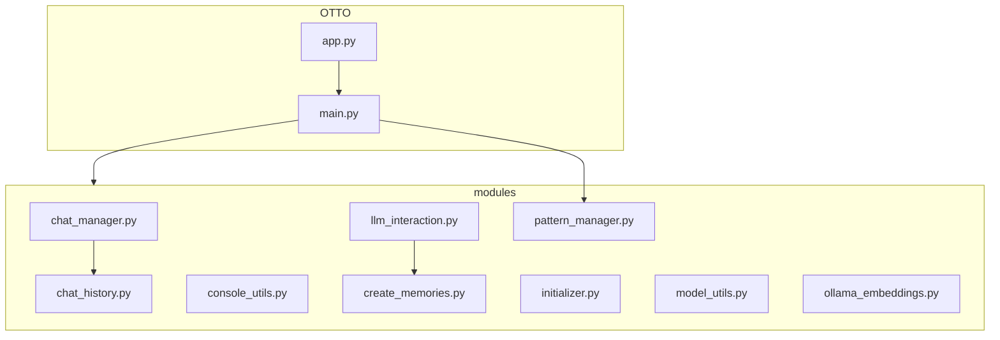

# 🧙‍♂️ OTTO's Magical Grimoire: Functions & System Architecture 🏰

Greetings, fellow sorcerers of code! Prepare to unravel the mystical workings of OTTO, your AI Chat Companion, now enhanced with the power of Fabric. This tome will guide you through the arcane structures and offer insights for weaving your own enchantments.

## 🌟 The Grand Overview

OTTO is a modular spellbook, with each scroll (module) handling specific magical tasks:

## 🔮 Core Magical Components

1. 🧠 **The Grand Ritual (app.py and main.py)**
   - Orchestrates the entire magical performance, like a conductor leading an AI symphony.
   - app.py acts as the incantation point, calling upon the powers of main.py.
   - main.py sets the stage, summons other modules, and manages the flow of the conversational adventure.

2. 💬 **Keeper of Conversations (chat_manager.py)**
   - Guardians of the Chat Realm, ensuring that every conversation is meticulously recorded and easily recalled.
   - Saves and loads entire conversations, allowing you to revisit past encounters with OTTO.

3. 📜 **Chronicler of Exchanges (chat_history.py)**
   - Diligently chronicles individual exchanges, preserving the ebb and flow of each interaction.
   - Manages the chat history, ensuring OTTO can access the context of your conversations.

4. 🗨️ **The AI Conjurer (llm_interaction.py)**
   - The bridge between the mortal realm and the domain of artificial intelligence.
   - Communes with the AI spirit (Ollama language model), channels its responses, and even conjures up a thinking animation while the AI ponders your queries.

5. 🔮 **The Model Summoner (model_utils.py)**
   - A master of summoning AI entities from the Ollama realm, each with unique strengths and capabilities.
   - Lists the available AI models and assists you in selecting the ideal companion for your quest.

6. 🖥️ **Master of the Visual Arts (console_utils.py)**
   - A true artisan of the console, responsible for the visual splendor of your AI adventure.
   - Crafts the colorful interface, banners, prompts, and displays, making your interaction with OTTO visually engaging.

7. 🧩 **Guardian of Context (assemble.py)**
   - A master of weaving together the threads of past interactions and external knowledge.
   - Provides OTTO with a richer context, enhancing its understanding and enabling more insightful responses.

8. 🔍 **Seeker of Web Knowledge (ddg_search.py)**
   - Empowers OTTO to venture into the vast digital library of the web.
   - Retrieves information using the DuckDuckGo search engine, enriching OTTO's knowledge base.

9. 🧠 **The Memory Weaver (create_memories.py and ollama_embeddings.py)**
   - These modules work together to capture and preserve the essence of OTTO's interactions.
   - create_memories.py stores the raw ingredients of each interaction—your prompts, OTTO's responses, and any relevant web search results.
   - ollama_embeddings.py: Transforms those memories into a language understood by AI, using embeddings to create a searchable and retrievable knowledge base.

10. 🧵 **The Pattern Loom (pattern_manager.py)**
    - NEW! Manages the Fabric patterns that guide OTTO's conversational flow.
    - Loads, selects, and applies conversation patterns to shape the AI's responses and behavior.

## 🎨 Customization Canvases 🎨

Unleash your creativity and enhance OTTO with these customization opportunities:

- 🌈 **Aesthetic Alchemy (console_utils.py)**
  - Modify colors, banners, and text styles to personalize OTTO's visual presence.
  - Add new visual effects or animations to enhance the interactive experience.

- 🧠 **Intellect Amplification (llm_interaction.py)**
  - Fine-tune the system message to shape OTTO's personality and conversational style.
  - Experiment with different prompt templates to tailor OTTO's responses for specific tasks or domains.

- 🔍 **Knowledge Expansion (assemble.py, ddg_search.py)**
  - Integrate additional search engines or knowledge bases to expand OTTO's access to information.
  - Implement more sophisticated context assembly techniques to deepen OTTO's understanding.

- 💾 **Memory Manipulation (chat_manager.py, chat_history.py)**
  - Explore alternative storage methods for chat history, such as database integration, for greater persistence and scalability.
  - Implement features like chat merging or selective memory deletion to curate OTTO's knowledge base.

- 🔮 **Model Mastery (model_utils.py)**
  - Add support for different AI model providers, giving users a wider choice of AI companions.
  - Implement the ability to switch between different AI models during a chat session, allowing for dynamic conversational experiences.

- 🧵 **Pattern Weaving (pattern_manager.py)**
  - Create new Fabric patterns to guide conversations on specific topics or for particular tasks.
  - Implement a pattern creation interface within OTTO, allowing users to craft custom conversation flows.

- 🌐 **Web Wizardry**
  - Craft a web interface for OTTO using a framework like Flask or FastAPI, making it accessible from any browser.
  - Implement real-time chat updates using WebSockets for a more seamless and engaging user experience.

## 🧪 Spell Testing

Ensure your enchantments are stable:

- Each scroll has its own test spell in the tests/ chamber.
- Cast pytest to verify all magical components.

## 🚀 Leveling Up OTTO

As you embark on your customization quest, remember these wise words:

- 📚 Document your arcane knowledge for future sorcerers.
- 🧹 Keep your code clean and modular for easy enchantment.
- 🛡️ Test your spells thoroughly to prevent magical mishaps.
- 🌟 Share your innovations with the OTTO community!

## 🧵 Fabric Integration Deep Dive

The Fabric integration adds a new layer of versatility to OTTO's conversational abilities:

1. **Pattern Structure**
   - Fabric patterns are stored as Markdown files in `~/.config/fabric/patterns/`.
   - Each pattern consists of a system message and optional user message templates.

2. **Pattern Selection**
   - Users can select patterns at the start of a conversation or switch patterns mid-conversation using the `/pattern` command.
   - The `pattern_manager.py` module handles loading, selecting, and applying patterns.

3. **Pattern Application**
   - When a pattern is selected, its system message is used to guide OTTO's behavior and responses.
   - The `llm_interaction.py` module incorporates the selected pattern into the AI's prompt.

4. **Custom Pattern Creation**
   - Users can create custom patterns by adding new Markdown files to the patterns directory.
   - Consider implementing a pattern creation interface within OTTO for easy customization.

5. **Pattern-Aware Memory**
   - Enhance the memory system to take into account the current pattern when storing and retrieving memories.
   - This allows for more context-aware recall and more coherent long-term conversations.

## 🔮 Future Enchantments

Consider these advanced features for future versions of OTTO:

1. **Multi-Model Conversations**: Allow OTTO to switch between different AI models based on the conversation context or user preferences.

2. **Adaptive Pattern Selection**: Implement an AI-driven system that automatically selects the most appropriate Fabric pattern based on the conversation flow.

3. **Interactive Pattern Creation**: Develop a guided interface for users to create new Fabric patterns through conversation with OTTO.

4. **Pattern Analytics**: Implement tracking and analysis of pattern usage to provide insights on which patterns are most effective or popular.

5. **Collaborative Patterns**: Create a system for users to share and rate custom Fabric patterns within the OTTO community.

6. **Voice Integration**: Expand the text-to-speech capabilities to include voice input, creating a fully voice-interactive AI companion.

7. **Multimodal Interactions**: Integrate image and audio processing capabilities, allowing OTTO to understand and generate multi-media content.

May your code be bug-free and your AI responses ever insightful! Happy enchanting, code sorcerers! 🧙‍♂️✨
