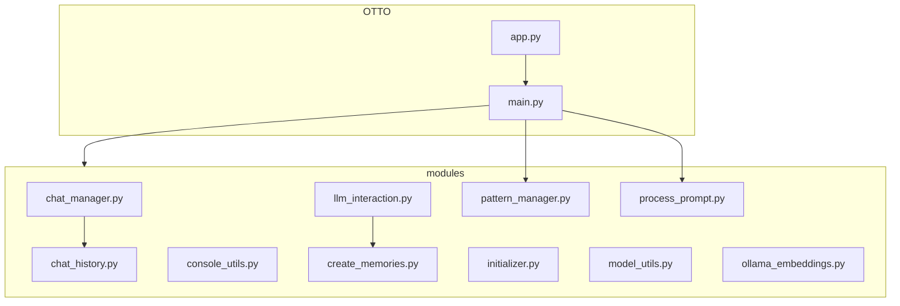

# 🧙‍♂️ OTTO's Magical Grimoire: Functions & System Architecture 🏰

Greetings, fellow sorcerers of code! Prepare to unravel the mystical workings of OTTO, your AI Chat Companion, now enhanced with the power of Fabric. This tome will guide you through the arcane structures and offer insights for weaving your own enchantments.

## 🌟 The Grand Overview

OTTO is a modular spellbook, with each scroll (module) handling specific magical tasks:

## 🔮 Core Magical Components

1. 🧠 **The Grand Ritual (app.py and main.py)**
   - Orchestrates the entire magical performance, like a conductor leading an AI symphony.
   - app.py acts as the incantation point, calling upon the powers of main.py.
   - main.py sets the stage, summons other modules, and manages the flow of the conversational adventure.

2. 💬 **Keeper of Conversations (chat_manager.py)**
   - Guardians of the Chat Realm, ensuring that every conversation is meticulously recorded and easily recalled.
   - Saves and loads entire conversations, allowing you to revisit past encounters with OTTO.

3. 📜 **Chronicler of Exchanges (chat_history.py)**
   - Diligently chronicles individual exchanges, preserving the ebb and flow of each interaction.
   - Manages the chat history, ensuring OTTO can access the context of your conversations.

4. 🗨️ **The AI Conjurer (llm_interaction.py)**
   - The bridge between the mortal realm and the domain of artificial intelligence.
   - Communes with the AI spirit (Ollama language model), channels its responses, and even conjures up a thinking animation while the AI ponders your queries.

5. 🔮 **The Model Summoner (model_utils.py)**
   - A master of summoning AI entities from the Ollama realm, each with unique strengths and capabilities.
   - Lists the available AI models and assists you in selecting the ideal companion for your quest.

6. 🖥️ **Master of the Visual Arts (console_utils.py)**
   - A true artisan of the console, responsible for the visual splendor of your AI adventure.
   - Crafts the colorful interface, banners, prompts, and displays, making your interaction with OTTO visually engaging.

7. 🧩 **Guardian of Context (assemble.py)**
   - A master of weaving together the threads of past interactions and external knowledge.
   - Provides OTTO with a richer context, enhancing its understanding and enabling more insightful responses.

8. 🔍 **Seeker of Web Knowledge (ddg_search.py)**
   - Empowers OTTO to venture into the vast digital library of the web.
   - Retrieves information using the DuckDuckGo search engine, enriching OTTO's knowledge base.

9. 🧠 **The Memory Weaver (create_memories.py and ollama_embeddings.py)**
   - These modules work together to capture and preserve the essence of OTTO's interactions.
   - create_memories.py stores the raw ingredients of each interaction—your prompts, OTTO's responses, and any relevant web search results.
   - ollama_embeddings.py: Transforms those memories into a language understood by AI, using embeddings to create a searchable and retrievable knowledge base.

10. 🧵 **The Pattern Loom (pattern_manager.py)**
    - Manages the Fabric patterns that guide OTTO's conversational flow.
    - Loads and selects conversation patterns to shape the AI's responses and behavior.

11. 🎭 **The Input Sorcerer (process_prompt.py)**
    - Interprets and processes user inputs, determining whether they are commands or prompts.
    - Handles various commands like searching, memory recall, chat management, and Fabric pattern selection.
    - Prepares prompts for the AI by adding context from searches or memory recalls.

## 🧵 Fabric Installation and Pattern Weaving

To harness the power of Fabric patterns in your OTTO installation, follow these arcane steps:

1. **Installation**
   - Ensure that the Fabric patterns are installed in the `~/.config/fabric/patterns/` directory.
   - If the patterns are not present, copy them from the `patterns/` directory in the OTTO repository to `~/.config/fabric/patterns/`.

2. **Pattern Structure**
   - Each Fabric pattern is stored in a separate directory within `~/.config/fabric/patterns/`.
   - A pattern directory should contain at least a `system.md` file, which defines the system message for the AI.
   - Optionally, a pattern directory can also include a `user.md` file, which provides a template for user inputs.

3. **Adding New Patterns**
   - To create a new Fabric pattern, follow these steps:
     1. Create a new directory in `~/.config/fabric/patterns/` with a descriptive name for your pattern.
     2. Inside the new directory, create a `system.md` file and write the system message that will guide the AI's behavior for this pattern.
     3. Optionally, create a `user.md` file to provide a template for user inputs specific to this pattern.
   - Your new pattern will now be available for selection within OTTO using the `/fabric` or `/f` command.

4. **Selecting Patterns**
   - During a conversation with OTTO, you can switch between Fabric patterns using the `/fabric` or `/f` command.
   - When prompted, choose a pattern from the list of available patterns by entering its corresponding number.
   - OTTO will load the selected pattern and use its system message to guide the conversation flow.

5. **Viewing Current Pattern**
   - To view the currently active Fabric pattern and its system content, use the `/showpattern` or `/sp` command.
   - OTTO will display the name of the current pattern and the content of its `system.md` file.

By mastering the art of Fabric patterns, you can tailor OTTO's conversational style and behavior to suit your specific needs and preferences. Experiment with different patterns and create your own to unlock new realms of AI-powered discourse!

## 🎨 Customization Canvases 🎨

Unleash your creativity and enhance OTTO with these customization opportunities:

- 🌈 **Aesthetic Alchemy (console_utils.py)**
  - Modify colors, banners, and text styles to personalize OTTO's visual presence.
  - Add new visual effects or animations to enhance the interactive experience.

- 🧠 **Intellect Amplification (llm_interaction.py)**
  - Fine-tune the system message to shape OTTO's personality and conversational style.
  - Experiment with different prompt templates to tailor OTTO's responses for specific tasks or domains.

- 🔍 **Knowledge Expansion (assemble.py, ddg_search.py)**
  - Integrate additional search engines or knowledge bases to expand OTTO's access to information.
  - Implement more sophisticated context assembly techniques to deepen OTTO's understanding.

- 💾 **Memory Manipulation (chat_manager.py, chat_history.py)**
  - Explore alternative storage methods for chat history, such as database integration, for greater persistence and scalability.
  - Implement features like chat merging or selective memory deletion to curate OTTO's knowledge base.

- 🔮 **Model Mastery (model_utils.py)**
  - Add support for different AI model providers, giving users a wider choice of AI companions.
  - Implement the ability to switch between different AI models during a chat session, allowing for dynamic conversational experiences.

- 🎭 **Input Enchantment (process_prompt.py)**
  - Develop new command interpretations to expand OTTO's capabilities.
  - Implement more advanced context-building techniques for user inputs.
  - Create custom handlers for specific types of user queries or commands.

- 🌐 **Web Wizardry**
  - Craft a web interface for OTTO using a framework like Flask or FastAPI, making it accessible from any browser.
  - Implement real-time chat updates using WebSockets for a more seamless and engaging user experience.

## 🧪 Spell Testing

Ensure your enchantments are stable:

- Each scroll has its own test spell in the tests/ chamber.
- Cast pytest to verify all magical components.

## 🚀 Leveling Up OTTO

As you embark on your customization quest, remember these wise words:

- 📚 Document your arcane knowledge for future sorcerers.
- 🧹 Keep your code clean and modular for easy enchantment.
- 🛡️ Test your spells thoroughly to prevent magical mishaps.
- 🌟 Share your innovations with the OTTO community!

May your code be bug-free and your AI responses ever insightful! Happy enchanting, code sorcerers! 🧙‍♂️✨
